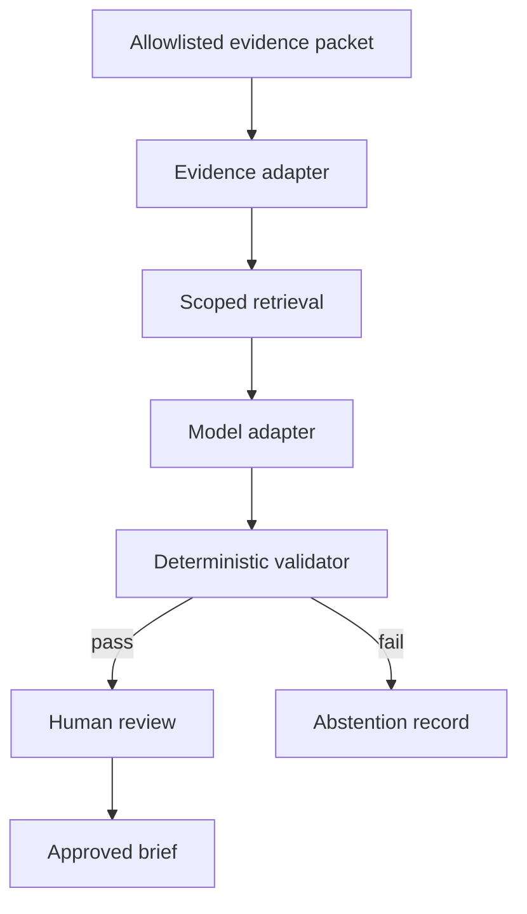

# Architecture — Governed Evidence-to-Decision Agent

## Architectural goal

Keep probabilistic generation inside a deterministic control envelope. The
model may propose a structured brief; deterministic components decide whether
the brief satisfies the evidence and policy contracts.

## Trust boundaries

### Trusted control plane

The evidence schema, allowlist, retrieval filters, output schema, validator and
audit writer are deterministic application components. Their versions are
recorded.

### Untrusted evidence content

Evidence may contain free text, malformed fields or embedded instructions.
Content such as “ignore previous rules” has no control authority and is passed
only as quoted data through explicit fields.

### Probabilistic model boundary

The model is treated as an untrusted transformation component. It cannot select
new sources, alter evidence, bypass validation, write the final audit decision
or invoke operational tools.

### Human authority boundary

Only a human reviewer may approve use of the brief. Approval does not transform
the lab into a safety, engineering or compliance authority.

## Components

### Evidence adapter

- validates schema and stable identifiers;
- removes fields outside the public or authorised boundary;
- records packet digest and freshness;
- fails closed on unsupported shapes.

### Scoped retriever

- searches only the supplied packet;
- returns evidence identifiers with excerpts or structured facts;
- never expands retrieval to another repository or network source implicitly.

### Model adapter

- accepts a fixed system contract and scoped evidence context;
- requests schema-constrained output;
- has no tool, network, file or actuator access;
- records provider/model and relevant inference configuration.

### Deterministic validator

- rejects missing or unknown evidence identifiers;
- checks that required claims contain citations;
- detects forbidden action-authority language;
- enforces answer status and limitation fields;
- records machine-readable findings.

Citation presence alone does not prove semantic support. M3 therefore includes
adversarial support evaluation and human review of critical claims.

### Audit writer

The append-only run record contains:

- run and contract versions;
- input packet digest and included evidence identifiers;
- prompt-template digest;
- model/configuration identity;
- raw structured proposal digest;
- validation findings;
- final disposition and optional human review metadata.

## Failure handling

| Failure | Required behaviour |
|---|---|
| Missing support | Abstain or qualify |
| Conflicting evidence | Surface conflict; do not silently choose |
| Stale evidence | Mark freshness limitation |
| Embedded instruction | Treat as inert evidence content |
| Unknown citation | Reject the proposal |
| Invalid output schema | Reject the proposal |
| Requested physical action | Refuse authority and redirect to human review |
| Sensitive excluded field | Block output and record validation failure |

## Claims boundary

The architecture supports evidence-grounded synthesis. It does not prove that a
model understands the operation, that cited claims are automatically correct or
that generated recommendations are safe. Those questions require explicit
evaluation and accountable domain review.
